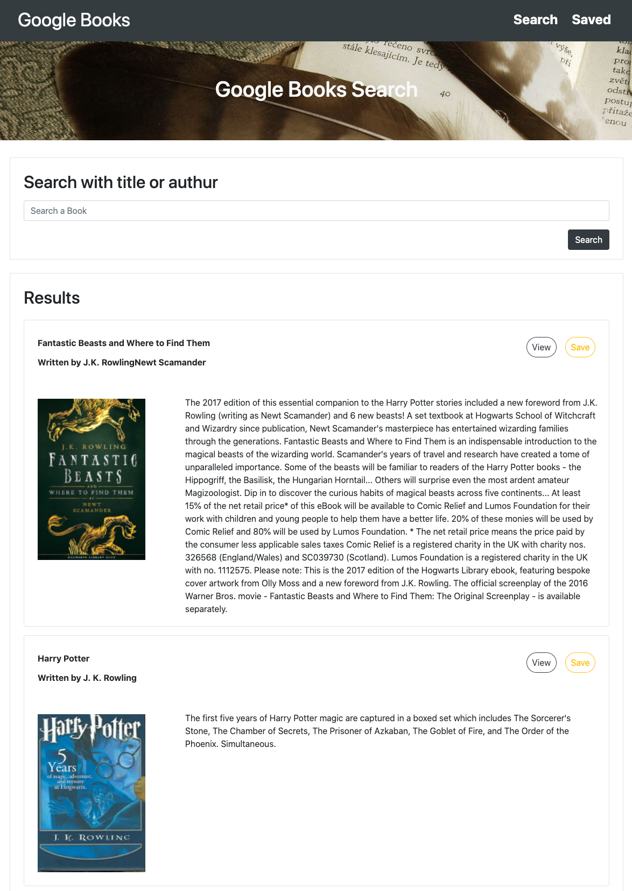
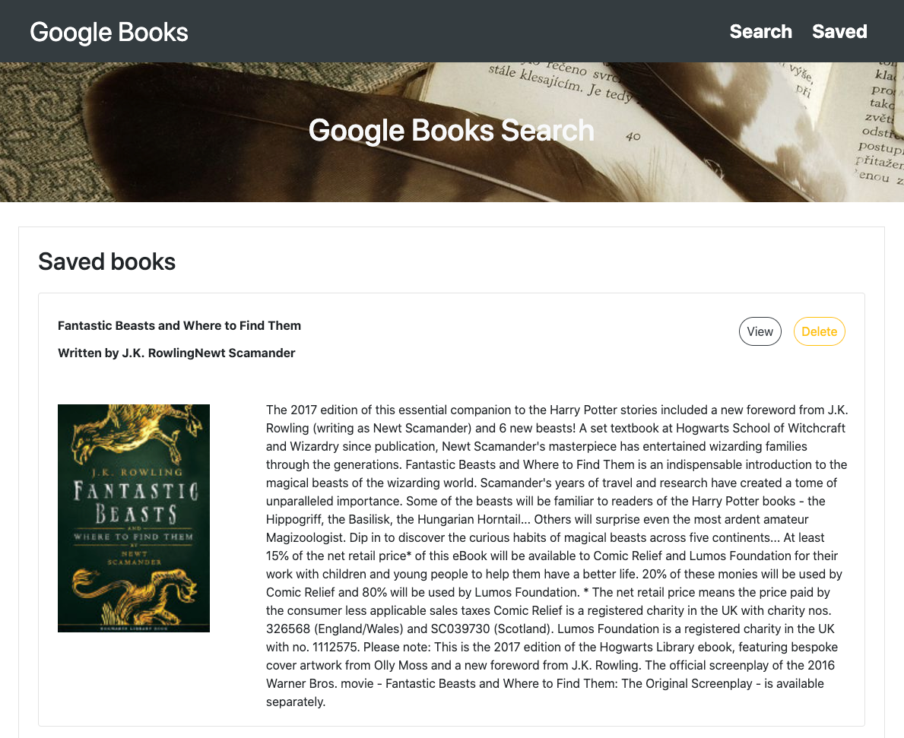

# Google Books

Depolyed link: https://shrouded-savannah-99948.herokuapp.com/

A web application that allows users to search and saved books.

Search - User can search for books via the Google Books API and render them here. User has the option to "View" a book, bringing them to the book on Google Books, or "Save" a book, saving it to the Mongo database.

Saved - Renders all books saved to the Mongo database. User has an option to "View" the book, bringing them to the book on Google Books, or "Delete" a book, removing it from the Mongo database.

## Instructions
1) Search book with title or authur.
2) Click "View" will lead you to google book store for more detail.
3) Click "Save" to store books.
4) Find saved books in "Saved".

## Images

